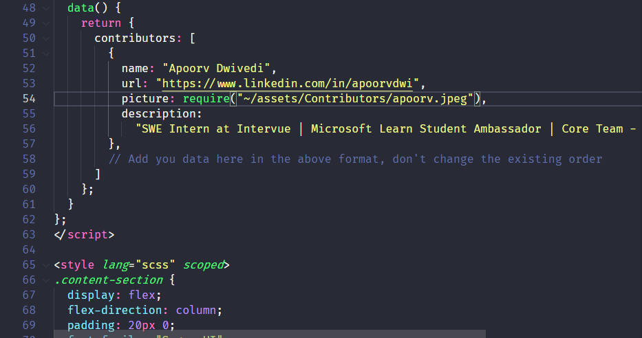

# 🔥 HacktoberFest Starter Project 🔥

Use this project to make your first contribution to an open source project on GitHub. Practice making your first pull request to a public repository before doing the real thing!

Celebrate [Hacktoberfest](https://hacktoberfest.digitalocean.com/) by getting involved in the open source community by completing some simple tasks in this project.

This repository is open to all members of the GitHub community. Any member may contribute to this project without being a collaborator.

## What is Hacktoberfest?

A month-long celebration from October 1st - 31st sponsored by [Digital Ocean](https://hacktoberfest.digitalocean.com/), [Appwrite](https://hacktoberfest.appwrite.io/), [Intel](http://devmesh.intel.com/) and [DeepSource](https://deepsource.io/hacktoberfest/) to get people involved in [Open Source](https://github.com/open-source). Create your very first pull request to any public repository on GitHub and contribute to the open source developer community.

[https://hacktoberfest.digitalocean.com/](https://hacktoberfest.digitalocean.com/)

## How to contribute to this project

Here are 3 quick and painless ways to contribute to this project:

- Add your name to the `CONTRIBUTORS.md` file
- Add you image in the assets/Contributors folder
- Add your details in components/Contributors2021Section.vue

See the below image for reference, where to add details



Make a pull request for your work and wait for it to be merged!

## Getting started

- Fork this repository (Click the Fork button in the top right of this page, click your Profile Image)
- Clone your fork down to your local machine

```markdown
git clone "Link to forked repository"
```

- Make your changes
- Commit and push

```markdown
git add .
git commit -m 'Commit message'
git push origin main
```

- Create a new pull request from your forked repository (Click the `New Pull Request` button located at the top of your repo)
- Wait for your PR review and merge approval!
- **Star this repository** if you had fun!

## Complete the following tasks

### 1. Add your name

Add your name to the `CONTRIBUTORS.md` file using the below convention:

```markdown
#### Name: [YOUR NAME](GitHub link)

- Place: City, State, Country
- Bio: Who are you?
- Linkedin: [Linkedin account name](Linkedin link)(
    
<!--If you have any other social media, you can add that as well here for example: Twitter, Instagram etc -->
```

### 2. Add your image

Add a `Your_Name.jpg/jpeg/png` file to the `assets/Contributors` directory.

### 3. Add your details

Add your details to the `components/Contributors2021Section.vue` file! Here is an example:

```Javascript
{
    name: "Apoorv Dwivedi",
    url: "https://www.linkedin.com/in/apoorvdwi",
    picture: require("~/assets/Contributors/apoorv.jpeg"),
    description: "SWE Intern at Intervue | Microsoft Learn Student Ambassador | Core Team - HackOn 2.0, HackThisFall 2.0"
}
```

## BONUS!

- See profiles submitted by fellow contributors from around the globe.
- Go on and Explore the codebase, if you feel anything can be improved go for it.

## Reference links

Here is a great tutorial for creating your first pull request by [Roshan Jossey](https://github.com/Roshanjossey):
[https://github.com/Roshanjossey/first-contributions](https://github.com/Roshanjossey/first-contributions)

Managing your Forked Repo: [https://help.github.com/articles/fork-a-repo/](https://help.github.com/articles/fork-a-repo/)

Syncing a Fork: [https://help.github.com/articles/syncing-a-fork/](https://help.github.com/articles/syncing-a-fork/)

Keep Your Fork Synced: [https://gist.github.com/CristinaSolana/1885435](https://gist.github.com/CristinaSolana/1885435)

Checkout this list for README examples - Awesome README [](https://github.com/sindresorhus/awesome)

Github-Flavored Markdown [https://guides.github.com/features/mastering-markdown/](https://guides.github.com/features/mastering-markdown/)